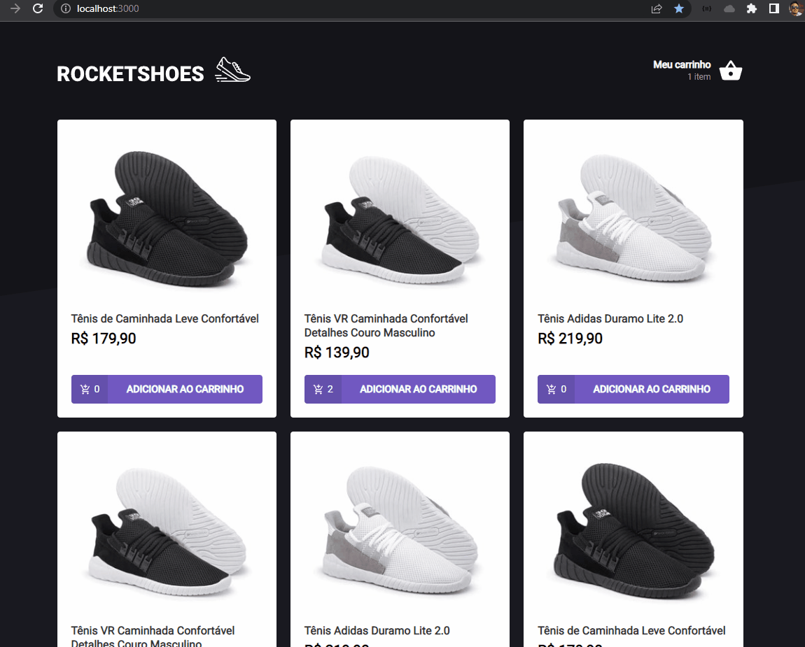

# Projeto Shoes Store - Baseado no RocketShoes
<br>
Projeto prático na trilha de React - Ignite

* [Sobre](#sobre)
* [Instalação](#instalação)


## Sobre
 * Aplicação simulando operação em Ecommerce com hook de carrinho de compras
<br>


## Instalação

#### Pré-requisitos
Antes de começar a rodar o projeto, você precisa ter instalado em sua máquina as seguintes ferramentas: 
[Git](https://git-scm.com/), [NodeJs](https://nodejs.org/en/).<br>
Além disso, para facilitar a visualização do código você vai precisar de um editor: [VSCode](https://code.visualstudio.com/).

#### Rodando a aplicação 🚀


```bash
#realize o clone do repositório
$ git clone https://https://github.com/mauriciolsfilho/shoes-store
```
```bash
#acesse a pasta do projeto
$ cd shoes-store
```
```bash 
#instale as dependências (ex: utilizando yarn)
$ yarn
```
```bash 
#execute o projeto
$ yarn start
```

